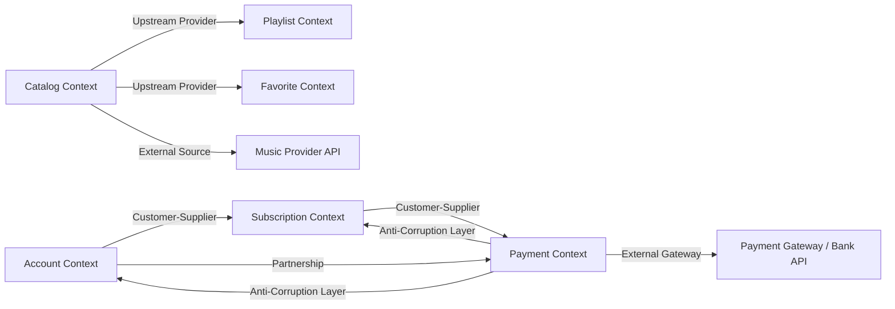

# 🎵 Music Streaming Platform – DDD + Spring Boot

Como proposto no enunciado da atividade o seguinte prjeto foi dividido em duas partes. A primeira pode ser verificada no item **Diagrama de Context Map (DDD)** e a segunda é a parte do código.

Este é um sistema acadêmico simulando uma plataforma de streaming de música com foco em **Domain-Driven Design (DDD)**, **Design Patterns** e **arquitetura em camadas com contextos isolados**.

---

# 📌 Visão Geral

O sistema implementa funcionalidades de:

- Criação de contas de usuário
- Gestão de assinaturas
- Processamento de transações financeiras
- Regras antifraude
- Validação de cartão de crédito

A arquitetura foi projetada utilizando **Bounded Contexts independentes**, seguindo princípios de **DDD estratégico e tático**.

---

# 🧠 Arquitetura do Sistema

## 📦 Bounded Contexts

- Account Context
- Subscription Context
- Payment Context

---

## 🏗️ Diagrama de Context Map (DDD)



---


## 🧱 Estrutura do projeto

src/main/java/com/acadl/musicstreaming
```
├── account
│   ├── controller
│   ├── domain
│   └── repository

├── subscription
│   ├── controller
│   ├── domain
│   ├── service
│   ├── repository
│   └── usecase

├── payment
│   ├── controller
│   ├── domain
│   ├── repository
│   ├── rule
│   ├── service
│   └── usecase

└── shared
    └── exception
```

## ⚙️ Tecnologias Utilizadas

- Java 17+
- Spring Boot
- Spring Web
- Spring Data JPA
- H2 Database
- Maven
- Lombok

## 🚀 Como Executar o Projeto
```bash
git clone https://github.com/seu-repositorio/music-streaming-ddd.git
cd music-streaming-ddd
```
Acessar H2 Database:
```http://localhost:8081/h2-console```

**User Name:** atddd

**Password:** teste


## 📡 Endpoints da API


##  Endpoints

### Account
| Método | Endpoint | Descrição |
|---|---|---|
| `POST` | `/accounts` | Criar conta |

### Subscription
| Método | Endpoint | Descrição |
|---|---|---|
| `POST` | `/subscriptions` | Criar plano |

### Payment
| Método | Endpoint | Descrição |
|---|---|---|
| `POST` | `/transactions` | Autorizar transação |

---

Exemplos de body:
 
- Para criar conta:

``` 
{
  "name": "User Name",
  "email": "user@email.com"
} 
```

- Para criar plano:

``` 
{
  "userId": "UUID"
}
```

- Para autorizar transação:

```
{
  "userId": "UUID",
  "merchant": "Spotify Premium",
  "amount": 29.90
}
```

Para testes o cartão de crédito precisa ser inserido manualmente:

``` sql
INSERT INTO credit_cards
(id, user_id, card_number, active)

VALUES
(
RANDOM_UUID(),
'UUID_DO_USUARIO',
'123456789',
true
);
```


## 🧠 Regras de Negócio

Subscription Context
- Um usuário pode ter apenas uma assinatura ativa
Payment Context (Antifraude)
- Cartão deve estar ativo
- Máximo de 3 transações em 2 minutos
- Máximo de 2 transações iguais no mesmo intervalo
- Regras implementadas com Strategy Pattern

## 🧩 Padrões de Projeto Aplicados

| Padrão | Aplicação |
|---|---|
| ✔️ Strategy Pattern | Fraud Rules |
| ✔️ Repository Pattern | Persistência por contexto |
| ✔️ Domain Service | Regras isoladas do domínio |
| ✔️ Use Case Pattern | Orquestração de fluxos |
| ✔️ Anti-Corruption Layer | Isolamento entre contextos |
| ✔️ Domain-Driven Design | Arquitetura geral |


## 📐 Conceitos de DDD Aplicados

**✔️ Bounded Contexts**
> Separação clara entre domínio de conta, assinatura e pagamento.

**✔️ Ubiquitous Language**
> Termos consistentes como `Subscription`, `Transaction`, `Credit Card`, `Fraud Rule`.

**✔️ Domain Services**
> Regras complexas isoladas do domínio das entidades.

**✔️ Aggregates**
> `User` · `Subscription` · `Transaction` · `CreditCard`


## 📌 Conclusão

Este projeto demonstra a aplicação prática de:

Domain-Driven Design
Clean Architecture simplificada
Design Patterns essenciais
Separação de contextos
Modelagem orientada ao domínio

O objetivo principal é manter um sistema:

- escalável
- modular
- testável
- e alinhado com boas práticas de engenharia de software.