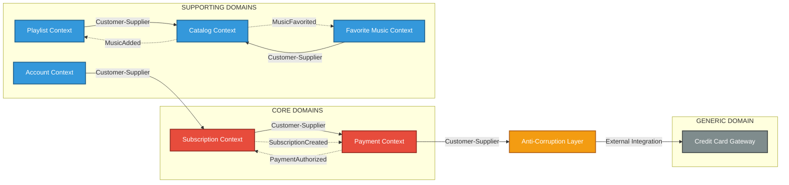

## Mapa de Contexto (Mermaid)

```mermaid
flowchart LR

    %% CORE DOMAINS
    subgraph CORE["CORE DOMAINS"]
        SUB["Subscription Context"]
        PAY["Payment Context"]
    end

    %% SUPPORTING DOMAINS
    subgraph SUPPORT["SUPPORTING DOMAINS"]
        ACC["Account Context"]
        PLAY["Playlist Context"]
        FAV["Favorite Music Context"]
        CAT["Catalog Context"]
    end

    %% GENERIC DOMAIN
    subgraph GENERIC["GENERIC DOMAIN"]
        CARD["Credit Card Gateway"]
    end

    %% ACL
    ACL["Anti-Corruption Layer"]

    %% RELACIONAMENTOS

    ACC -->|Customer-Supplier| SUB

    SUB -->|Customer-Supplier| PAY

    PLAY -->|Customer-Supplier| CAT

    FAV -->|Customer-Supplier| CAT

    PAY -->|Customer-Supplier| ACL

    ACL -->|External Integration| CARD

    %% DOMAIN EVENTS

    SUB -.->|SubscriptionCreated| PAY

    PAY -.->|PaymentAuthorized| SUB

    CAT -.->|MusicAdded| PLAY

    CAT -.->|MusicFavorited| FAV

    %% CORES

    classDef core fill:#E74C3C,color:#fff,stroke:#922B21,stroke-width:2px;
    classDef support fill:#3498DB,color:#fff,stroke:#21618C,stroke-width:2px;
    classDef generic fill:#7F8C8D,color:#fff,stroke:#424949,stroke-width:2px;
    classDef acl fill:#F39C12,color:#fff,stroke:#AF601A,stroke-width:2px;

    class SUB,PAY core;
    class ACC,PLAY,FAV,CAT support;
    class CARD generic;
    class ACL acl;
```

---